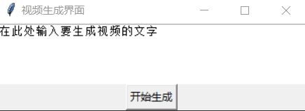

[切换到中文版本](README_zh.md) 

[Switch to English Version](README.md)

## Usage

1. Install the required environment:

   ```bash
   pip install -r requirements.txt
   ```

2. Download the model file to the project directory. Model file download link: [Model File](https://pan.baidu.com/s/1cADfwCXCJQDwEkWIf4CwTQ?pwd=6666) Extraction code: 6666

3. If you prefer to use the lazy one-click package, you can download and install:

   [Lazy One-click Package Download Link](https://pan.baidu.com/s/1pUWWCwv5MYTKUXYQIahMRQ?pwd=6666) Extraction code: 6666

4. Run the Python file `main.py`:

   ```bash
   python main.py
   ```

You can now start using the project to generate videos! If you have any questions or suggestions, feel free to raise an issue.

## Example

The interface style is as shown in the figure:



When we input the text "Pandas eat bamboo on rocks," the generated video example:

[Video Example, Click to Download](./testoutput.mp4)
